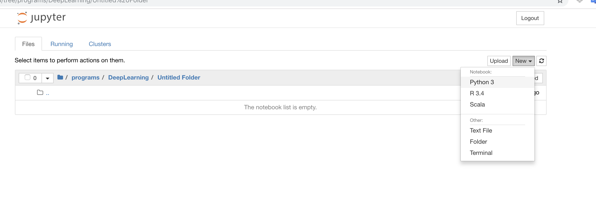
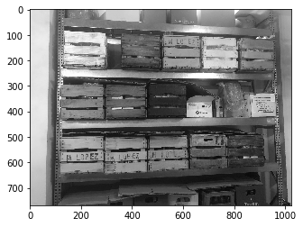

# How to install pytorch with conda

Here we will explain how to install pytorch with conda.

## Downloading

In terminal execute the following line:

```
wget https://repo.continuum.io/miniconda/Miniconda3-3.7.0-MacOSX-x86_64.sh\
    -O ~/miniconda.sh
bash ~/miniconda.sh -b -p $HOME/miniconda
```

You can choose right version for your system following <https://conda.io/docs/user-guide/install/index.html>. Just change the string: `Miniconda3-3.7.0-MacOSX-x86_64`.

## Adding conda to PATH

Then add `conda` to `$PATH` by running

```
export PATH="$HOME/miniconda/bin:$PATH"
```
If you do not want to run it each time you start the system you can add this line to `.bash_profile` (or `.bashrc`).

## Update it

```
conda update conda
```

## Creating and activating environment 


```
conda create -n conda3.6 python=3.6
source activate conda3.6
```

You can deactivate it with `source deactive`. More info on <https://conda.io/docs/user-guide/tasks/manage-environments.html>

## Installing programs needed

```
conda install mkl
conda install numpy pandas jupyter ipython scikit-learn plotly
conda install pytorch torchvision -c pytorch
conda install -c conda-forge matplotlib opencv
```

## Run jupyter and test it

After activating environment run

```
jupyter notebook
```

When the web page opens, click on button "New", choose "Python 3".



Then copy the following into the cell and press Control+Enter. Change `imgs/shelf.JPG` to any image of your coice.


```python
import numpy as np
import torch
import torch.nn as nn
import torch.nn.functional as F
import matplotlib.pyplot as plt
%matplotlib inline
import cv2

bgr_img = cv2.imread('imgs/shelf.JPG')
gray_img = cv2.cvtColor(bgr_img, cv2.COLOR_BGR2GRAY).astype("float32")/255

plt.imshow(gray_img, cmap='gray')
plt.show()
```




