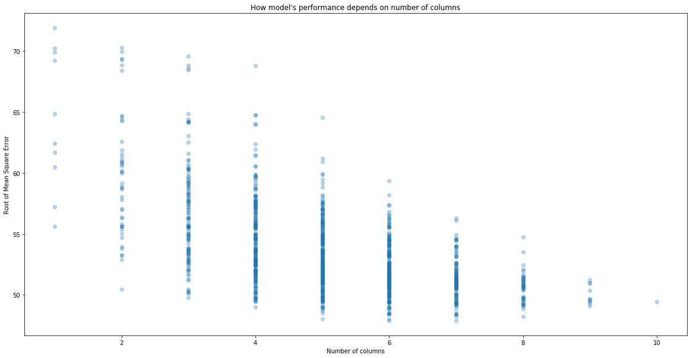
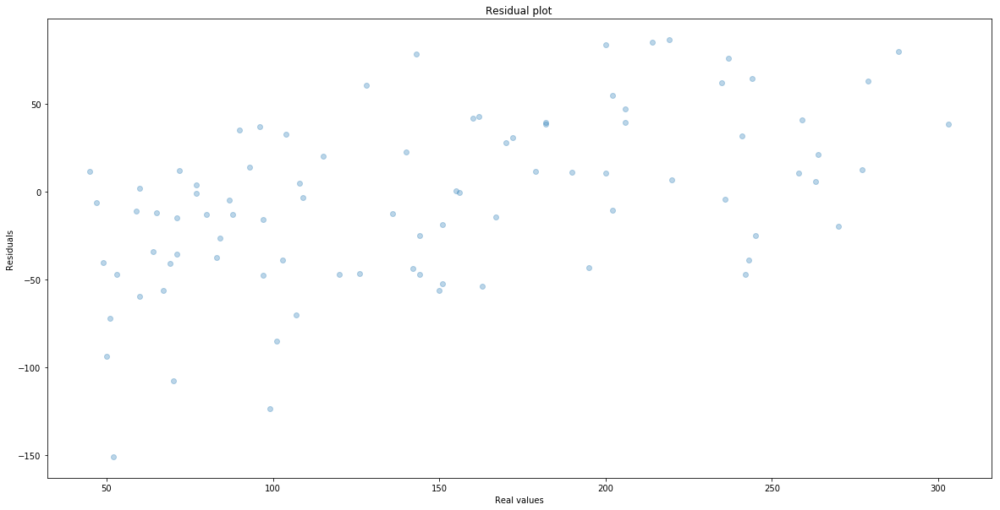

query("dt > '1961'").---
layout: post
comments: true
title:  "Machine Learning Part 3: How to choose best multiple linear model"
date:   2019-02-16 08:00:00 +0200
categories: ml python sklearn
---
## Introduction

In this note we would like to explain two concepts.
* How to choose best models.
* What __Multiple Linear Regression__ is. 

Here we will explain why splitting the dataset may not be enough and we introduce train-dev-test splitting.

## Diabetes dataset


```python
import matplotlib
import matplotlib.pyplot as plt
import numpy as np
import pandas as pd
from sklearn import datasets
```


```python
matplotlib.rcParams['figure.figsize'] = [20, 10]
```


```python
diabetes = datasets.load_diabetes()
```

## Problem

__Main Question__ Which model is better?
1. Model that predict disease progression based on body mass.
2. Model that predict disease progression based on all 10 features.

## Multiple Linear Regression

In order to predict disease progression based on all 10 features we will build a model called Multiple Linear Regression. 

__Multiple Linear Regression__ is a model that have $n+1$ parameters $a_0$, $a_1$,... $a_n$ and $b$ and has the form:

$$\hat{y} = a_0x_0 + a_1x_1 + \ldots + a_nx_n + b$$

Recall that, in our case, we have the following 10 variables:
* $x_0$: age, 
* $x_1$: sex, 
* $x_2$: body mass index, 
* $x_3$: average blood pressure, 
* $x_4$, $x_5$, $x_6$, $x_7$, $x_8$, $x_9$: six blood serum measurements.
    
So we have 11 parameters $a_0$, $a_1$, $a_2$, $a_3$, $a_4$, $a_5$, $a_6$, $a_7$, $a_8$, $a_9$ and $b$. So the model has a form:

$$\hat{y} = a_0x_0 + a_1x_1 + a_2x_2 + a_3x_3 + a_4x_4 + a_5x_5 + a_6x_6 + + a_7x_7 + a_8x_8 + a_9x_9 + b$$

## Building and testing models

So here we will execute the following steps:

1. Prepare data.
2. Split data into train and test.
3. Build a models and further data preparation for each model.
4. Fit models to train data on selected columns.
5. Evaluate models on test data and compare performance.

#### 1. Prepare data

Since the second model uses all columns our $X$ is simply entire dataset. When we will train model we will do further data selection.


```python
X = diabetes.data
y = diabetes.target
```

#### 2. Split data into train and test.


```python
from sklearn.model_selection import train_test_split
X_train, X_test, y_train, y_test = train_test_split(X, y, random_state=666, test_size=0.1)
```

#### 3. Build a models


```python
from sklearn.linear_model import LinearRegression
reg1 = LinearRegression()
reg2 = LinearRegression()
```

#### 4. Fit models to train data on selected columns.


```python
reg1.fit(X_train[:, [2]], y_train) # here we choose only second column
reg2.fit(X_train, y_train) # here we take all possible variables
```


    LinearRegression(copy_X=True, fit_intercept=True, n_jobs=None,
             normalize=False)


#### 5. Evaluate models on test data and compare performance.


```python
from sklearn.metrics import mean_squared_error, r2_score
y_test_hat1 = reg1.predict(X_test[:, [2]])
y_test_hat2 = reg2.predict(X_test)
np.sqrt(mean_squared_error(y_test, y_test_hat1)), np.sqrt(mean_squared_error(y_test, y_test_hat2))
```


    (55.85346157514181, 47.61322195051475)


### Conclusion

We have seen that the model based on all variables has better perfomance than the model based just on one variable. However, in what follows we will see that there is actually a better choice of variables. We will try to find them by considering all possible combinations of colums.

## All possible combinations of columns

We will again execute the same steps, but this time we choose all combinations columns. This will give us lots of models to test.

1. Prepare data.
2. Split data into train and test.
3. Build a models and further data preparation for each model.
4. Fit models to train data on selected columns.
5. Evaluate models on test data and compare performance.


```python
from itertools import combinations

# 1. Prepare data.
X = diabetes.data
y = diabetes.target

# 2. Split data into train and test.
X_train, X_test, y_train, y_test = train_test_split(X, y, random_state=666, test_size=0.2)

# 3. Build a models and further data preparation for each model.
# 4. Fit models to train data on selected columns.
# 5. Evaluate models on test data and compare performance.

def fit_and_evaluate(columns, X_train, X_test, y_test):
    """
    Function that evaluate how model train on specific combination of columns performs
    
    columns: variable that that contains a list of columns that we use to train a particular model
    X_train: Dataset that we use to train the model
    X_test: Dataset that we use to test the model
    y_test: true predictions for test dataset
    
    returns: root means square error evaluated on test dataset
    """
    # Build the model
    reg = LinearRegression()
    
    # Fit the model to dataset with specific columns
    reg.fit(X_train[:, columns], y_train)
    
    # Evaluate models on test data.
    y_test_hat = reg.predict(X_test[:, columns])
    return np.sqrt(mean_squared_error(y_test, y_test_hat))

def get_performance_on_combinations_of_columns(X_train, X_test, y_test):
    """
    Function that generate all combination of columns
    and then evaluate how model train on that combinations performs
    
    X_train: Dataset that we use to train the model
    X_test: Dataset that we use to test the model
    y_test: true predictions for test dataset
    
    returns: DataFrame with
        - number of columns used
        - specific combination of columns
        - root means square error evaluated on test dataset
    """
    all_columns_num = X_train.shape[1]
    all_colnames = list(range(all_columns_num))
    
    performance = pd.DataFrame(
        columns=["n_columns", "columns", "RMSE"]
    )

    for columns_num in range(1, all_columns_num + 1):
        for columns in combinations(all_colnames, columns_num):
            rmse = fit_and_evaluate(columns, X_train, X_test, y_test)
            new_row = pd.DataFrame({
                "n_columns": [columns_num], 
                "columns": [columns], 
                "RMSE": [rmse]
            })
            performance = performance.append(new_row, ignore_index = True)  
    return performance
```


```python
performance = get_performance_on_combinations_of_columns(X_train, X_test, y_test) 
        
print("Total number of non-empty combination is {}.".format(len(performance)))
```

    Total number of non-empty combination is 1023.


```python
plt.scatter(performance["n_columns"], performance["RMSE"], alpha = 0.3)
plt.xlabel("Number of columns")
plt.ylabel("Root of Mean Square Error")
plt.title("How model's performance depends on number of columns")
```


    Text(0.5, 1.0, "How model's performance depends on number of columns")





```python
# Best performing models

performance.sort_values("RMSE").head()
```


<div>
<style scoped>
    .dataframe tbody tr th:only-of-type {
        vertical-align: middle;
    }

    .dataframe tbody tr th {
        vertical-align: top;
    }

    .dataframe thead th {
        text-align: right;
    }
</style>
<table border="1" class="dataframe">
  <thead>
    <tr style="text-align: right;">
      <th></th>
      <th>RMSE</th>
      <th>columns</th>
      <th>n_columns</th>
    </tr>
  </thead>
  <tbody>
    <tr>
      <th>781</th>
      <td>47.880858</td>
      <td>(1, 2, 3, 6, 8, 9)</td>
      <td>6</td>
    </tr>
    <tr>
      <th>865</th>
      <td>47.889001</td>
      <td>(0, 1, 2, 3, 6, 8, 9)</td>
      <td>7</td>
    </tr>
    <tr>
      <th>521</th>
      <td>48.020136</td>
      <td>(1, 2, 3, 6, 8)</td>
      <td>5</td>
    </tr>
    <tr>
      <th>647</th>
      <td>48.038394</td>
      <td>(0, 1, 2, 3, 6, 8)</td>
      <td>6</td>
    </tr>
    <tr>
      <th>981</th>
      <td>48.210301</td>
      <td>(0, 1, 2, 3, 6, 7, 8, 9)</td>
      <td>8</td>
    </tr>
  </tbody>
</table>
</div>


So the best choice of columns are columns: `(1, 2, 3, 6, 8, 9)`. Let's see what they are.


```python
[diabetes.feature_names[i] for i in [1, 2, 3, 6, 8, 9]]
```


    ['sex', 'bmi', 'bp', 's3', 's5', 's6']


Let's see what are the parameters of this model.


```python
best_reg = LinearRegression()
best_reg.fit(X_train[:, (1, 2, 3, 6, 8, 9)], y_train)
y_test_hat = best_reg.predict(X_test[:, (1, 2, 3, 6, 8, 9)])
print("Parameters a: ", best_reg.coef_)
print("Parameter b: ", best_reg.intercept_)
```

    Parameters a:  [-225.78647725  533.21599131  319.5160069  -293.65810211  491.19212091
       35.45789137]
    Parameter b:  153.00353416418773


### Where we make largest mistakes

When we train the model we can do further analysis where we have made the largest mistake. It is almost imposible to plot and then understand the plot of a function that have that many variables. Therefore it is common to plot residuals that is the difference between the real value and the predicted one. That is

$$e_i = y_i - \hat{y}_i$$

We plot it against the real value $y_i$. Here is the plot.


```python

plt.scatter(y_test, y_test-y_test_hat, alpha = 0.3)
plt.xlabel("Real values")
plt.ylabel("Residuals")
plt.title("Residual plot")
```


    Text(0.5, 1.0, 'Residual plot')





One can see that we make the largest mistakes when real values are small.

## Hyperparameters and train-dev-test split

Let us recall that by __parameters__ we understand coeficients of our model. In the case of our best model we have 7 parameters:

$$\hat{y} = a_1x_1 + a_2x_3 + a_3x_3 + a_6x_6 + a_8x_8 + a_9x_9 + b$$

where $a_1, a_2, a_3, a_6, a_8, a_9$ are


```python
best_reg.coef_
```


    array([-225.78647725,  533.21599131,  319.5160069 , -293.65810211,
            491.19212091,   35.45789137])


and $b$ (called also bias) is


```python
best_reg.intercept_
```


    153.00353416418773


However, as we have said before we have also another kind of parameters that are actually our choice of columns. Those are called __hyperparameters__. In order to find them we have also done some fitting. We have taken 1023 combinations and see which one has performed best on our test dataset. This is not very scientific, since we use this set to report final performance of our fitted model. Therefore we introduce further splitting of train set into validation set. 


1. Prepare data. 
2. Split data into train,  dev and test.
3. Build models, fit them to train dataset and evaluate on dev dataset.
4. Choose the hyperparameters of the model that performs best on dev.
5. Build and fit the model with these hyperparameters to both train and dev datasets.
5. Evaluate the best model performance of test.


```python
# 1. Prepare data.
X = diabetes.data
y = diabetes.target
# 2. Split data into train,  dev and test.
X_train_dev, X_test, y_train_dev, y_test = train_test_split(X, y, random_state=666, test_size=0.2)
X_train, X_dev, y_train, y_dev = train_test_split(X_train_dev, y_train_dev, random_state=667, test_size=0.25)
```


```python
len(y_train), len(y_dev), len(y_test)
```


    (264, 89, 89)


```python
# 3. Build models, fit them to train dataset and evaluate on dev dataset.

performance = get_performance_on_combinations_of_columns(X_train, X_dev, y_dev) 
performance.sort_values("RMSE").head()
```


<div>
<style scoped>
    .dataframe tbody tr th:only-of-type {
        vertical-align: middle;
    }

    .dataframe tbody tr th {
        vertical-align: top;
    }

    .dataframe thead th {
        text-align: right;
    }
</style>
<table border="1" class="dataframe">
  <thead>
    <tr style="text-align: right;">
      <th></th>
      <th>RMSE</th>
      <th>columns</th>
      <th>n_columns</th>
    </tr>
  </thead>
  <tbody>
    <tr>
      <th>765</th>
      <td>56.184161</td>
      <td>(1, 2, 3, 4, 5, 8)</td>
      <td>6</td>
    </tr>
    <tr>
      <th>932</th>
      <td>56.211273</td>
      <td>(1, 2, 3, 4, 5, 6, 8)</td>
      <td>7</td>
    </tr>
    <tr>
      <th>849</th>
      <td>56.262737</td>
      <td>(0, 1, 2, 3, 4, 5, 8)</td>
      <td>7</td>
    </tr>
    <tr>
      <th>968</th>
      <td>56.297644</td>
      <td>(0, 1, 2, 3, 4, 5, 6, 8)</td>
      <td>8</td>
    </tr>
    <tr>
      <th>936</th>
      <td>56.301163</td>
      <td>(1, 2, 3, 4, 5, 8, 9)</td>
      <td>7</td>
    </tr>
  </tbody>
</table>
</div>


```python
# 4. Choose the hyperparameters of the model that performs best on dev.
best_columns = (1, 2, 3, 4, 5, 8)

# 5. Build and fit the model with these hyperparameters to both train and dev datasets.
c = LinearRegression()
best_reg.fit(X_train_dev[:, best_columns], y_train_dev)
y_test_hat = best_reg.predict(X_test[:, best_columns])
np.sqrt(mean_squared_error(y_test, y_test_hat))
```


    49.320937456254434


## Exercise 1: Boston dataset

In this exercise we will use Boston Dataset to answer the following question.

__Question__ What is the best choice of columns for linear model of median value of owner-occupied homes?

Here we have the data set.


```python
from sklearn.datasets import load_boston
boston = load_boston()
```

## Exercise 2*: Step features selection 

Here we have tried all the possible combination of columns. This often impossible or very expensive to do due to, for example, large number of features, or the algorithm we use is complicated and it takes lots of time to try them all. There is another way to do this and it leads to performance that is good enough. And in practice, good enough is great. 

It goes as follows.
1. Train models that depends only on one variable, validate the model on `dev` set and choose the best one.
2. Now train models adding just one variable, that is still not used. 
3. If one from the new models has better performance then the previous one, select the best one a repeat the step _2_, if there are still some variables left. Otherwise stop.

Your objective is to implement it for Diabetes dataset.


__Next__ In the next part we will explain what Multiple Linear Regression is, and how to choose best model if we have many of them.
See [Machine Learning Part 4: Bias–Variance Trade-Off in Polinomial Regression]()

_Updated: 2019-02-17_
